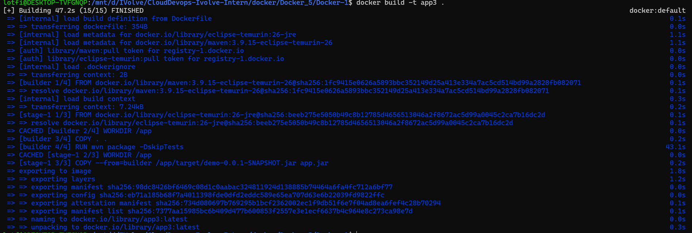
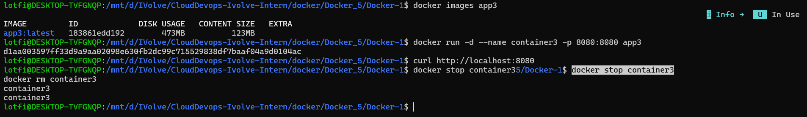

# Lab 5: Multi-Stage Build for a Java Spring Boot App

This lab uses a multi-stage Dockerfile so Maven builds the Spring Boot application in a builder stage, while the final image contains only the Java runtime and the packaged JAR.

## Repository Contents

- `Docker-1/Dockerfile`: Multi-stage Dockerfile.
- `Docker-1/pom.xml`: Maven project configuration.
- `Docker-1/src/main/java/com/example/demo/DemoApplication.java`: Spring Boot entry point.
- `Docker-1/target/demo-0.0.1-SNAPSHOT.jar`: Generated artifact from the local build output.

## Dockerfile Summary

Stage 1 uses `maven:3.9.15-eclipse-temurin-26` to run `mvn package -DskipTests`. Stage 2 uses `eclipse-temurin:26-jre`, copies the built JAR as `app.jar`, exposes port `8080`, and starts the app.

## Steps

```bash
cd Docker-1

docker build -t app3 .
docker images app3

docker run -d --name container3 -p 8080:8080 app3
curl http://localhost:8080

docker stop container3
docker rm container3
```

## Verification

The final image should be close in size to the runtime-only image from Lab 4, while still allowing Docker to perform the build.

## Screenshots

Screenshots are included in `screen-shots/`:

- `screen-shots/build.png`: Multi-stage Docker build output.
- `screen-shots/run-test-stop-delete.png`: Container run, test, stop, and delete flow.




