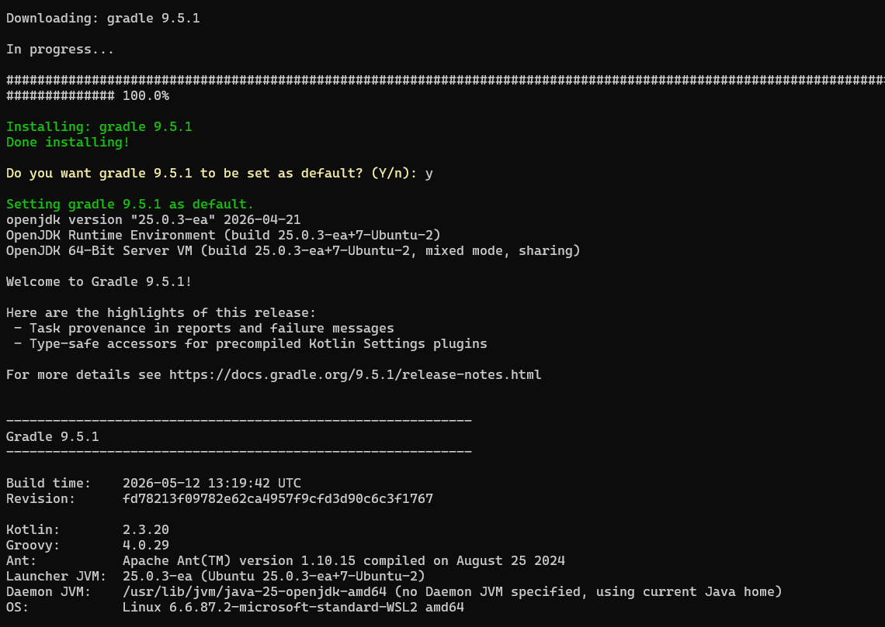
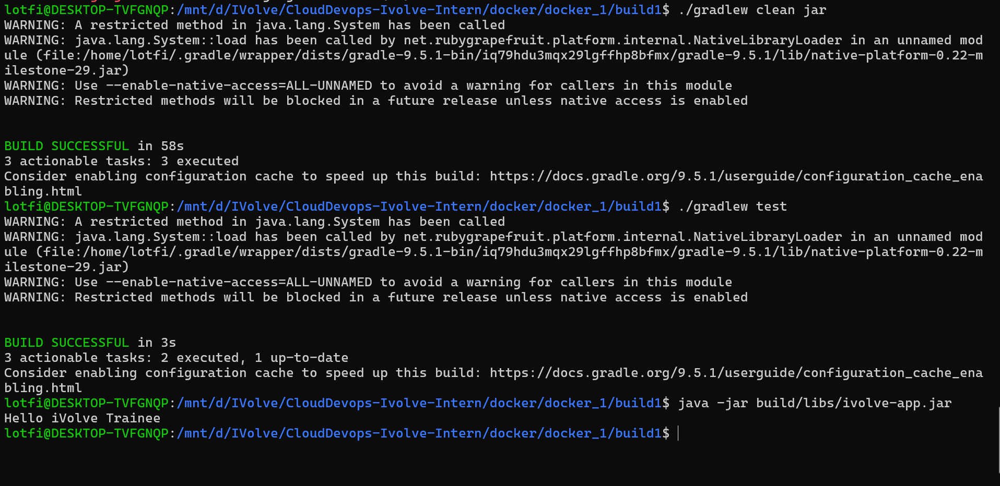

# Lab 1: Building and Packaging Java Applications with Gradle

This lab builds a small Java console application with Gradle, runs its unit test, packages it as an executable JAR, and verifies the app output.

## Repository Contents

- `build1/build.gradle`: Gradle Java application configuration.
- `build1/gradle/wrapper/gradle-wrapper.properties`: Gradle wrapper configured for Gradle `9.5.1`.
- `build1/src/main/java/com/ivolve/App.java`: Prints `Hello iVolve Trainee`.
- `build1/src/test/java/com/ivolve/AppTest.java`: Unit test for the console output.
- `build1/build/libs/ivolve-app.jar`: Generated runnable artifact.

## Version Notes

- Gradle wrapper: `9.5.1`
- Java toolchain in `build.gradle`: `25`
- Test framework: JUnit `4.13.2`

## Steps

```bash
cd build1

./gradlew test
./gradlew jar

java -jar build/libs/ivolve-app.jar
```

Expected output:

```text
Hello iVolve Trainee
```

## Verification

The generated JAR is available at `build1/build/libs/ivolve-app.jar`. Test reports are generated under `build1/build/reports/tests/test/`.

## Screenshots

Screenshots are included in `screen-shots/`:

- `screen-shots/install-gradle.png`: Gradle installation/version verification.
- `screen-shots/docker_1.png`: Test, build, run, and app verification output.




