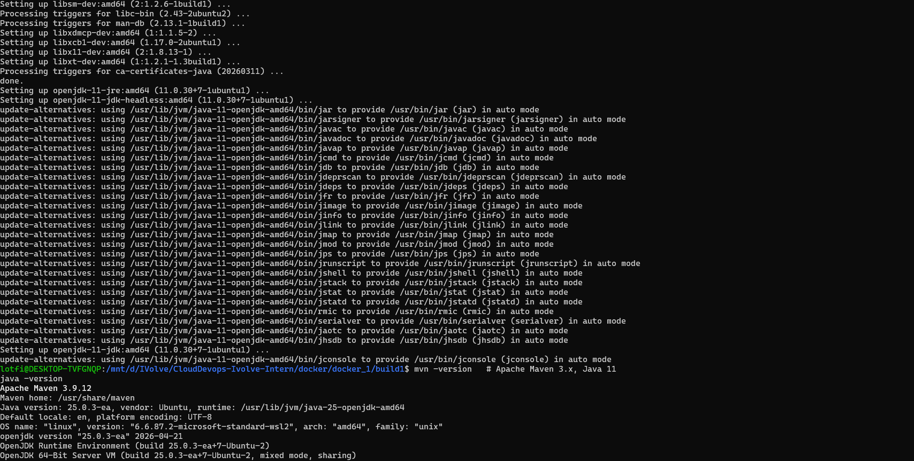
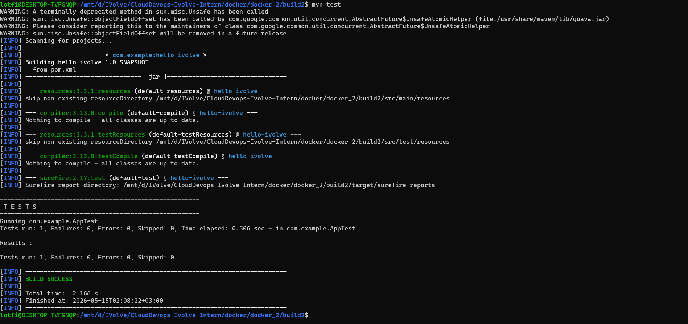
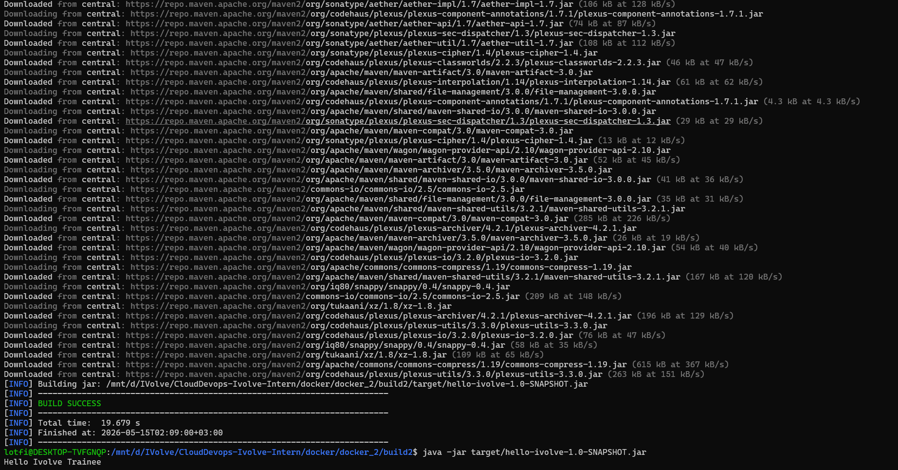

# Lab 2: Building and Packaging Java Applications with Maven

This lab builds a Java console application with Maven, runs the unit test suite, packages the application as an executable JAR, and verifies the runtime output.

## Repository Contents

- `build2/pom.xml`: Maven project file with Java `11` source/target settings.
- `build2/src/main/java/com/example/App.java`: Prints `Hello Ivolve Trainee`.
- `build2/src/test/java/com/example/AppTest.java`: JUnit test for the application output.
- `build2/target/hello-ivolve-1.0-SNAPSHOT.jar`: Generated executable JAR.

## Version Notes

- Java compiler source/target: `11`
- Test framework: JUnit `4.13.2`
- Maven JAR plugin: `3.2.0`

## Steps

```bash
cd build2

mvn test
mvn package

java -jar target/hello-ivolve-1.0-SNAPSHOT.jar
```

Expected output:

```text
Hello Ivolve Trainee
```

## Verification

Maven test reports are generated under `build2/target/surefire-reports/`, and the final artifact is generated under `build2/target/`.

## Screenshots

Screenshots are included in `screen-shots/`:

- `screen-shots/install-mvn.png`: Maven installation/version verification.
- `screen-shots/test.png`: Test execution result.
- `screen-shots/app-working.png`: Packaged application running successfully.






