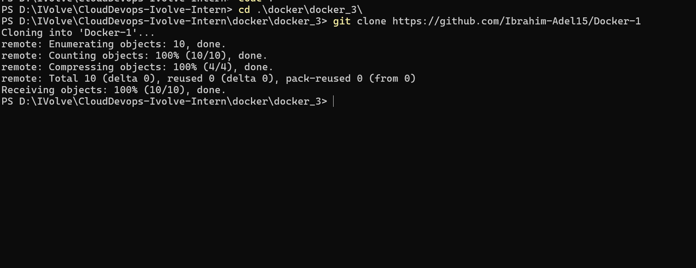
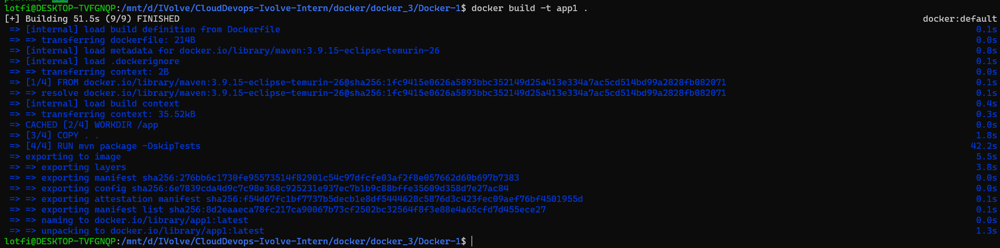
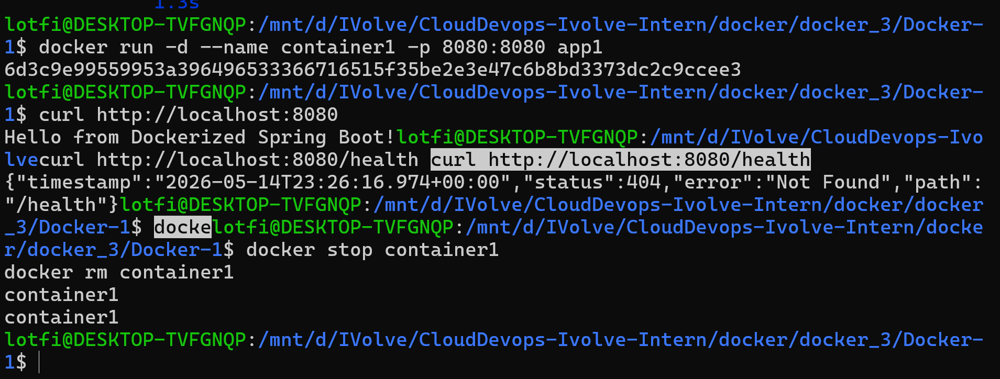

# Lab 3: Run Java Spring Boot App in a Container

This lab containerizes a Spring Boot application using a single-stage Docker build. Maven and the JDK are included in the final image because the application is built inside the same container image that runs it.

## Repository Contents

- `Docker-1/Dockerfile`: Single-stage Dockerfile based on `maven:3.9.15-eclipse-temurin-26`.
- `Docker-1/pom.xml`: Maven project configuration for the Spring Boot app.
- `Docker-1/src/main/java/com/example/demo/DemoApplication.java`: Spring Boot entry point.

## Dockerfile Summary

The image copies the full source code, runs `mvn package -DskipTests`, exposes port `8080`, and starts `target/demo-0.0.1-SNAPSHOT.jar`.

## Steps

```bash
cd Docker-1

docker build -t app1 .
docker run -d --name container1 -p 8080:8080 app1

curl http://localhost:8080

docker stop container1
docker rm container1
```

## Verification

The app should respond on `http://localhost:8080` after the container starts.

## Screenshots

Screenshots are included in `screen-shots/`:

- `screen-shots/clone-rep.png`: Source clone/setup step.
- `screen-shots/build-image.png`: Docker image build output.
- `screen-shots/run-test-stop-delete.png`: Container run, test, stop, and delete flow.






