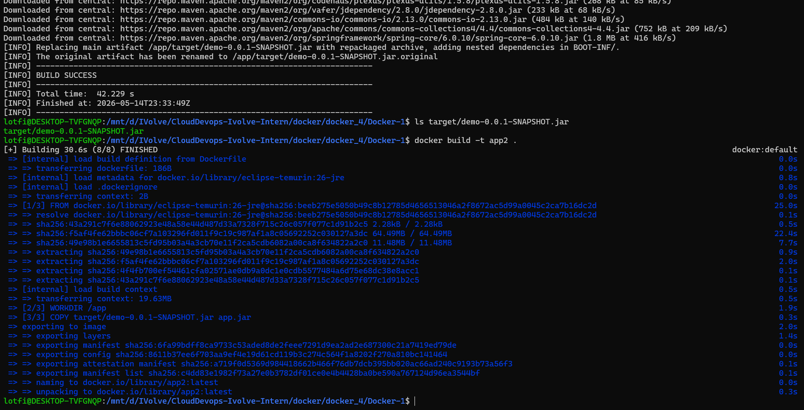
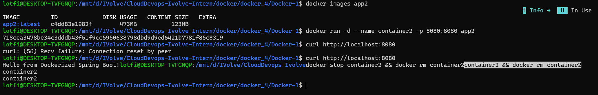

# Lab 4: Run Java Spring Boot App from a Pre-Built JAR

This lab builds the Spring Boot JAR locally first, then creates a smaller runtime Docker image that only contains the Java runtime and the generated artifact.

## Repository Contents

- `Docker-1/Dockerfile`: Runtime-only Dockerfile based on `eclipse-temurin:26-jre`.
- `Docker-1/pom.xml`: Maven project configuration.
- `Docker-1/target/demo-0.0.1-SNAPSHOT.jar`: Pre-built Spring Boot artifact copied into the image.

## Dockerfile Summary

The Dockerfile copies `target/demo-0.0.1-SNAPSHOT.jar` as `app.jar`, exposes port `8080`, and runs it with `java -jar`.

## Steps

```bash
cd Docker-1

mvn package -DskipTests
docker build -t app2 .
docker images app2

docker run -d --name container2 -p 8080:8080 app2
curl http://localhost:8080

docker stop container2
docker rm container2
```

## Verification

The app should respond on `http://localhost:8080`. The image should be smaller than the single-stage Maven image because it does not include Maven or the full source tree.

## Screenshots

Screenshots are included in `screen-shots/`:

- `screen-shots/build.png`: Image build and size check.
- `screen-shots/run-test-stop-delete.png`: Container run, test, stop, and delete flow.




